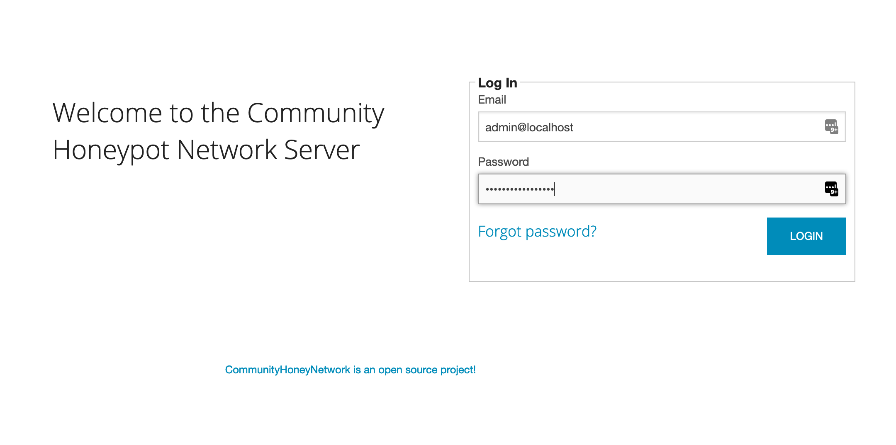

Configuring and Exploring CHN Server Containers
====================================

*Please Note:* All the following docker-compose commands must be run from the directory which contains the 
docker-compose.yml file, in our workshop this should be `/opt/chnserver`. If you need to change to this directory at 
any point, simply issue the command:

```bash
cd /opt/chnserver
```

## Running Containers
Once CHN Server is running, you can check the status of your containers with the following docker-compose command:

```bash
docker-compose ps
```

## Seeing Logs

Full logs for the running Docker containers can be viewed using the following command

```bash
docker-compose logs
```

This can result in a large number of logs for a long-running container. Some options to help control the amount of 
data are to specify a container name and/or add a `--tail` command. For instance, this will show only the logs from 
the hpfeeds container:
```bash
docker-compose logs hpfeeds
```
You can also limit the log output to the last X lines for a particular container, for example:

```bash
docker-compose logs --tail=10 chnserver
```

It is often useful to tail the last few lines of logs and follow the logfile for any new lines, to see new items as 
they happen. Simply add the `-f` switch:
 
```bash
 docker-compose logs --tail=10 -f chnserver
```
 
Try switching to your browser, refreshing the tab with the CHN Server web interface up, then switch back to the 
terminal to see that the logs have updated.

Use `Ctrl-C` to stop following the logs and return to your prompt.

## Controlling Containers 
You can stop all the running containers using the following command. This will stop the containers but will leave the 
containers in their current state.

```bash
docker-compose stop
```

If you wish to remove a specific container (after stopping it) you can remove it with the `docker-compose rm` command:

```bash
docker-compose rm chnserver
```

You can stop and remove *all* running containers with the following command. If you have made any changes to the 
running containers themselves (not recommended!), this will effectively reset the containers.

```bash
docker-compose down
```

Now let's bring all our containers back up again:

```bash
docker-compose up -d
```

This time the process is much faster, as the images are already stored locally. 

## (Re)set the web administrator password

If you didn't set a default admin password in your `chnserver.sysconfig` file, you can use the following command to 
set the password, using `admin@localhost` as the email address.

```bash
docker-compose exec chnserver python /opt/manual_password_reset.py
```

After setting your password, go ahead an log into the web portal using the "admin@localhost" credential with the 
password you just set at `https://workshop-chn-TEAM.security.duke.edu` (don't forget to subsitute your number for 
TEAM!).




